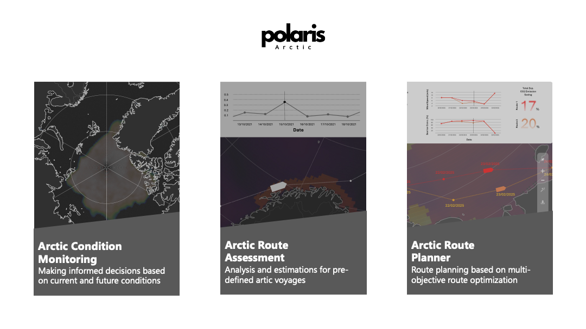

# Polaris - Arctic
This repository is owned by the team 'Polaris - Arctic' and used for __HackEOn 2025__ and __EPFL AMLD 2025: AI&Space Session__.

- [Slide](Polaris-Arctic-AMLD2025.pdf)

## Motivation
___Polaris - Arctic___ is a tool to deliver Earth Observation Data for more efficient and safer using of Arctic Shipping Route.



## Environmetal Setup
You can install all dependencies by running a Conda installation script, given with:

```
conda env create -f environment.yaml
```

After that, please run the environment:

```
conda activate polaris-arctic-v0
```

## Dataset
```data_preparation.ipynb```

## Analaysis
```visualization.ipynb```
